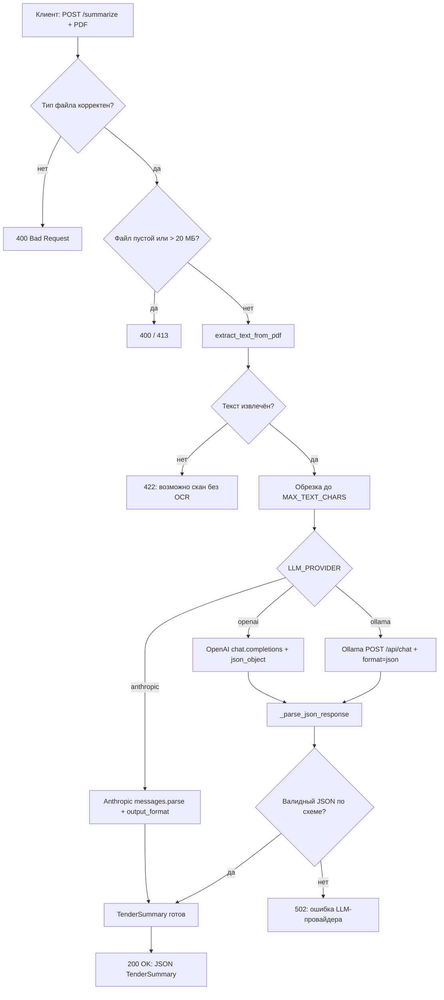

# Логика решения и алгоритм работы

## 1. Задача

На вход подаётся PDF-файл тендерной документации (извещение о закупке,
скачанное с площадки госзакупок). Нужно вернуть структурированную выжимку
из четырёх ключевых блоков:

1. сумма контракта;
2. сроки выполнения работ/услуг;
3. ключевые требования к исполнителю;
4. штрафы и неустойки за нарушение условий контракта.

Плюс краткое текстовое резюме документа (2–4 предложения).

## 2. Архитектура

```
app/
├── main.py        # FastAPI: HTTP-слой, валидация запроса, коды ошибок
├── pdf_utils.py    # извлечение текста из PDF
├── llm.py          # обращение к LLM-провайдеру и парсинг ответа
├── schemas.py      # контракт данных (Pydantic-модель TenderSummary)
└── config.py       # настройки из .env (выбор провайдера, ключи, модели)
```

Каждый модуль отвечает за один шаг конвейера «файл → текст → структурированные
данные» и не знает о деталях реализации соседних шагов — `main.py` вызывает
`extract_text_from_pdf()` и `summarize_tender()` как чёрные ящики.

## 3. Алгоритм обработки запроса (`POST /summarize`)

1. **Приём файла.** Клиент отправляет `multipart/form-data` с полем `file`.
2. **Валидация типа.** Файл должен иметь расширение `.pdf` или
   `content_type == application/pdf`. Иначе — `400`.
3. **Валидация содержимого.** Пустой файл — `400`; файл больше 20 МБ — `413`.
4. **Извлечение текста** (`pdf_utils.extract_text_from_pdf`):
   - PDF открывается через `pypdf.PdfReader`;
   - если документ зашифрован, делается попытка расшифровки пустым паролем
     (типичный случай для выгрузок с площадок закупок — они ставят пароль
     владельца, но не пароль на открытие);
   - текст постранично извлекается и склеивается через `\n`;
   - если после этого текст пустой (скан без OCR) — `422`.
5. **Обрезка текста** до `MAX_TEXT_CHARS` (по умолчанию 60000 символов) —
   ограничение на размер контекста и стоимость запроса к LLM.
6. **Выбор провайдера** по значению `LLM_PROVIDER` из `.env`
   (`anthropic` / `openai` / `ollama`).
7. **Формирование промпта:**
   - системный промпт задаёт роль и главное ограничение — не придумывать
     данные, которых нет в тексте;
   - пользовательский промпт перечисляет 5 пунктов, которые нужно найти,
     и подставляет текст документа;
   - для OpenAI и Ollama дополнительно передаётся `JSON_SCHEMA_HINT` —
     явное описание ожидаемой JSON-схемы (у Anthropic вместо этого
     используется параметр `output_format`, который гарантирует структуру
     ответа на уровне SDK).
8. **Вызов LLM:**
   - Anthropic — `messages.parse(..., output_format=TenderSummary)`,
     ответ уже провалидирован SDK;
   - OpenAI — `chat.completions.create(..., response_format={"type": "json_object"})`,
     ответ парсится и валидируется вручную через `TenderSummary.model_validate_json`;
   - Ollama — HTTP POST на `{OLLAMA_BASE_URL}/api/chat` с `"format": "json"`
     и `temperature: 0` (снижает риск того, что модель уйдёт от строгого
     JSON в свободный текст — актуально для младших моделей), ответ также
     парсится вручную.
9. **Разбор ответа** (`_parse_json_response`) — единая точка валидации для
   OpenAI и Ollama: если ответ не парсится как `TenderSummary`, ошибка
   логируется вместе с сырым содержимым и пробрасывается наверх.
10. **Возврат результата или ошибки:**
    - успех → `200` с телом `TenderSummary`;
    - ошибка чтения PDF → `422`;
    - ошибка на стороне LLM (нет ключа, сеть, невалидный JSON) → `502`.

## 4. Схема рабочего процесса



## 5. Обработка ошибок

| Код | Причина                                              |
|-----|-------------------------------------------------------|
| 400 | Не PDF, либо файл пустой                              |
| 413 | Файл больше 20 МБ                                     |
| 422 | PDF не читается / зашифрован без возможности снять защиту / нет текстового слоя |
| 502 | Провайдер LLM недоступен, нет API-ключа, либо ответ не соответствует схеме |

## 6. Известные ограничения

- Нет OCR — сканы без текстового слоя не обрабатываются.
- Качество извлечения штрафов и сроков напрямую зависит от модели: младшие
  модели (например, бесплатный тариф Ollama Cloud) на длинных документах
  иногда упускают детали из конца текста при агрессивной обрезке
  `MAX_TEXT_CHARS`.
- Единственная точка расширения на новый LLM-провайдер — ручное добавление
  ветки `if/elif` в `summarize_tender()` (см. `README.md`, раздел про SOLID).
