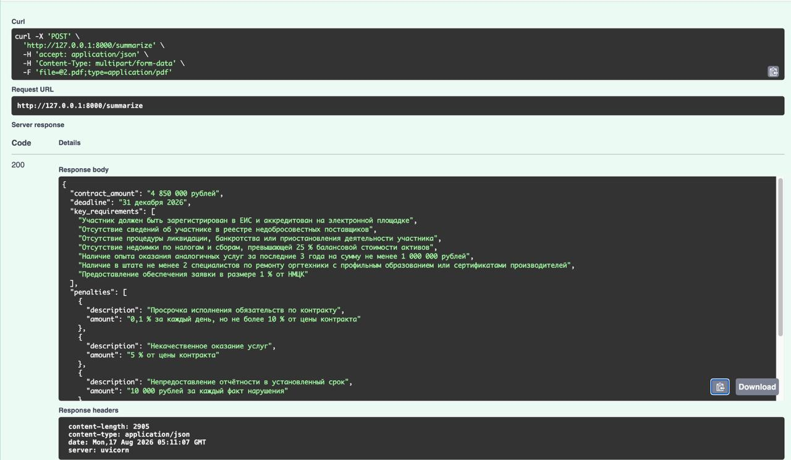
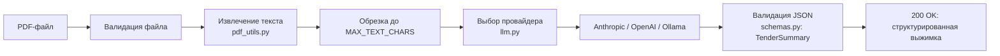

# Smart Tender Documentation Summarizer

Сервис на FastAPI, который принимает PDF тендерной документации
(извещение о закупке) и возвращает структурированную выжимку с помощью
LLM: сумма контракта, сроки выполнения, ключевые требования к исполнителю
и штрафы/неустойки. Подробное описание алгоритма — в [`ALGORITHM.md`](./ALGORITHM.md).

## Установка и запуск

```bash
python -m venv .venv
source .venv/bin/activate
pip install -r requirements.txt

cp .env.example .env
# заполнить LLM_PROVIDER и ключ нужного провайдера в .env

uvicorn app.main:app --reload --port 8000
```

Проверка: `GET http://127.0.0.1:8000/health`, интерактивная документация —
`http://127.0.0.1:8000/docs`.

## Пример работы

Запрос `POST /summarize` с тестовым PDF через Swagger UI и структурированный
ответ со всеми четырьмя полями (сумма контракта, сроки, требования,
штрафы):



## Конфигурация (`.env`)

| Переменная | Назначение |
|---|---|
| `LLM_PROVIDER` | `anthropic` \| `openai` \| `ollama` |
| `ANTHROPIC_API_KEY`, `ANTHROPIC_MODEL` | ключ и модель Anthropic |
| `OPENAI_API_KEY`, `OPENAI_MODEL` | ключ и модель OpenAI |
| `OLLAMA_BASE_URL`, `OLLAMA_MODEL`, `OLLAMA_API_KEY` | локальный `ollama serve` (без ключа) или облако `https://ollama.com` (с ключом) |
| `MAX_TEXT_CHARS` | лимит символов текста документа, уходящего в LLM |

## Схема рабочего процесса



Полная диаграмма с ветвлениями и кодами ошибок — в
[`ALGORITHM.md`](./ALGORITHM.md#4-схема-рабочего-процесса).

## Применение принципов SOLID и KISS

Честная оценка, а не формальная галочка — что применено, а что сознательно
упрощено ради размера проекта.

### KISS — применяется целенаправленно

Три провайдера (`anthropic`, `openai`, `ollama`) переключаются через простой
`if/elif` в `summarize_tender()` (`app/llm.py`), а не через фабрику или
plugin-реестр. Для трёх известных провайдеров абстракция усложнила бы код,
не дав практической пользы — это ровно тот случай, когда лишний слой
не окупается. Общая функция `_parse_json_response()` переиспользуется для
OpenAI и Ollama вместо дублирования логики парсинга.

### SRP (Single Responsibility) — соблюдается

Каждый модуль отвечает за одно решение:

- `pdf_utils.py` — только извлечение текста из PDF;
- `schemas.py` — только контракт данных;
- `config.py` — только настройки из `.env`;
- `llm.py` — только обращение к LLM и разбор ответа;
- `main.py` — только HTTP-слой (валидация запроса, коды ошибок).

`main.py:summarize()` делает несколько проверок подряд (тип файла, размер,
извлечение текста, вызов LLM), но это нормально для тонкого контроллера —
дробить его дальше значило бы просто раскладывать код по файлам, не снижая
сложность.

### OCP (Open/Closed) и DIP (Dependency Inversion) — сознательно не соблюдены

`summarize_tender()` напрямую вызывает три конкретные функции
(`_summarize_with_anthropic/openai/ollama`) через `if/elif` вместо того,
чтобы зависеть от абстракции (`Protocol`/стратегия) и позволять добавлять
провайдеров без изменения этой функции. Формально это нарушение OCP и DIP.

Осознанный компромисс: провайдеров три, список не растёт часто, а
стратегия/реестр — это дополнительный уровень косвенности, который
усложнил бы чтение кода без реальной выгоды на таком масштабе (см. KISS
выше). Если провайдеров станет больше пяти или добавление нового провайдера
станет частой операцией — стоит вынести общий интерфейс
`LLMProvider.summarize(text) -> TenderSummary` и регистрировать провайдеров
в словаре `{name: provider}`.

### LSP и ISP — неприменимы

В кодовой базе нет наследования классов и интерфейсов, поэтому Liskov
Substitution и Interface Segregation здесь не в игре.

## Тестирование

```bash
pip install pytest
pytest app/test_early_pdf_utils/ -v
```

## Известные ограничения

См. раздел «Известные ограничения» в [`ALGORITHM.md`](./ALGORITHM.md#6-известные-ограничения).
